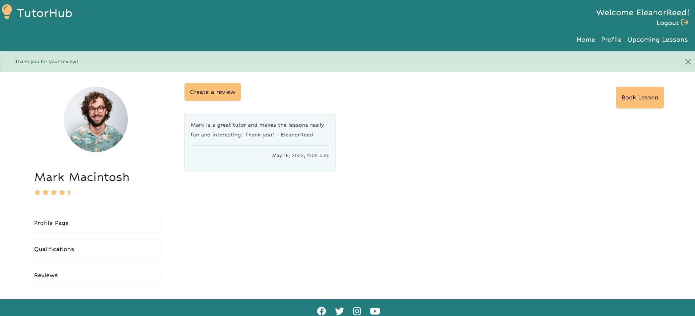
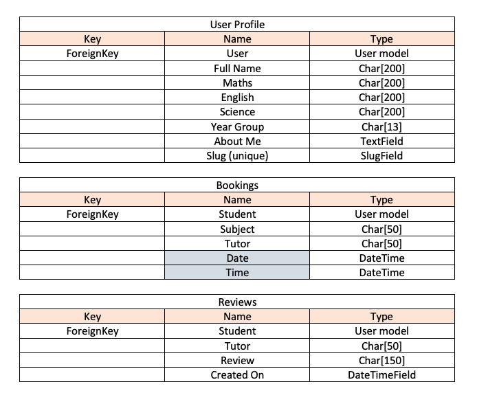

[Tutoring Site Live Link](https://tutoring-hub.herokuapp.com/)
[Github Repository](https://github.com/sophiebatten123/Tutoring-Hub)

# TutorHub

(Developer: Sophie Batten)

Tutor Hub offers secondary school pupils world class tuition FREE as part of the education recovery plan. It is vital, now more than ever, that students are able gain a deeper relational understanding of concepts and understand the practical nature of STEM subjects, all of which have been set aside throughout the pandemic. Our tutors deliver their lesson via [Microsoft Teams](https://www.microsoft.com/en-gb/microsoft-teams/group-chat-software?rtc=1) which ensures no smart technology is required and gives all pupils regardless of their background the opportunity to learn.

The site is fully responsive and designed in a simplistic and easy to navigate manner. It has been coded using HTML, CSS, JavaScript, Python and Django using the MVC framework to scaffold the design process. Furthermore, the project went through continuous agile development to ensure features were working effectively.

# Table of Contents:

- [UX](#ux)
  - [User Stories](#user-stories)
  - [Agile Planning](#agile-planning-enviroment)
  - [Design](#tutorhub-design)
    - [Colour Scheme](#colour-scheme)
    - [Typography](#typography)
    - [Imagery](#imagery)
  - [Wireframes](#wireframes)
    - [Desktop Wireframes](#desktop-wireframe)
    - [Mobile Wireframes](#mobile-wireframe)
    - [Site Improvements](#site-improvements)
  - [Features](#features)
    - [Register/ Login](#register-or-login)
    - [Create Student Profiles](#create-a-student-profile)
    - [Tutor Information](#tutor-information)
    - [Book in Tutoring Lessons](#book-in-tutoring-lessons)
    - [View/Cancel Upcoming Lessons](#view-or-cancel-upcoming-lessons)
    - [Leave Tutor Reviews](#leave-tutor-reviews)
 - [Functionality](#functionality)
    - [Fixed Bugs and Errors](#fixed-bugs-and-errors)
    - [Technologies Used](#technologies-used)
    - [Programs Used](#programs-used)
- [Databases]
    - [Upcoming Lesson Data](#upcoming-lessons-data-structure)
- [Testing](#testing)
    - [Manual Testing](#manual-testing)
    - [Automatic Testing](#automatic-testing)
    - [Wave Testing](#wave-testing)
- [Future Features](#future-features)
- [Deployment](#deployment)
- [Credits](#credits)

# UX

## User Stories

### First Time Visitor Goals:
1. As a First Time Visitor, I should be able to sign up for a student account.
2. As a First Time Visitor, I should be able to create a profile page based upon my subject needs.
3. As a First Time Visitor, I should have clear instructions on how tutoring sessions are ran.
4. As a First Time Visitor, I should be able to view the tutor's profiles, qualifications and reviews.
5. As a First Time Visitor, I should be able to book in a tutoring session with one of the tutors.

### Returning Visitor Goals:
6. As a Returning Visitor, I should be able to view upcoming tutoring sessions on my profile page.
7. As a Returning Visitor, I should be able to cancel bookings that I am no longer able to attend.
8. As a Returning Visitor, I should be able to leave reviews on the tutor pages. 

### Frequent Visitor Goals:
9. As a Frequent Visitor, I should be able to edit my account if my details change.
10. As a Frequent Visitor, I want my tutor to have availability for lessons so I don't get behind on my studies.

# Agile Planning Environment

## MoSCow Method

Throughout my project I frequently used the project board on GitHub ensuring I carefully followed the MoSCow method.

To ensure that the ideas I had for my project were realistic in the timeframe given it was important to:
- Ensure the 'Must Have' elements never exceeded 60% of the assigned tasks.
- Regularly update the project board and reflect upon each iteration.
- Refer to the project board regularly to keep focussed throughout the project.

Using the MoSCow technique was extremely useful and helped me to accomplish more during my project. 
Below is a screenshot of the Agile Planning environment that I used throughout my project:

# Design
## TutorHub Design

Throughout this project it was important that the design of the site was simplistic and carefully incorporated contrasting colours. 
This was accomplished by delicately adding turquoise and orange within the icons, button and header elements on the page. 

By using this technique, the following criteria was accomplished:
- Foreground elements were never hindered by the background colours.
- Elements of importance stood out clearly on the page for the user. 
- Site navigation was clear, cohesive and easy to navigate.

## Colour Scheme

The colours for the site were selected through product research. It became clear that similar sites often use contrasting colours, making things 'pop' on the page. Furthermore, it was important that the colours on the site allowed an easy flow of content throughout.

## Typography

Fonts were equally important on the site. The aim was to create a childish feeling to the site, complementing the cartoon imagery seen within the header image. Moreover, text colours were kept simple either black or white with only the icon colours changing. This was to ensure that the information was accessible to users who may be visually impaired.

## Imagery

# Wireframes

## Desktop Wireframes

    
Desktop Wireframes - Click Here:

    
    
    
    

## Mobile Wireframes

    
Mobile Wireframes - Click Here:

    
    
    
    

# Site Improvements

Tutor Hub has a few opportunities for development that would complement the sites' purpose. These include:

- Users would benefit from the option to 'rearrange' lesson bookings as opposed to just having the option to cancel them.
- Users would benefit from receiving email confirmation when a lesson has been successfully booked.
- Users would benefit from the ability to share good work on the site, this would help contribute to the community ethos.

# Features

## Register or Login

- Upon entering the site users have the option to sign up for an account or, if already registered, login to their pre-existing accounts. **(User Story 1)**
- This feature allows the user to book in lessons and leave tutor reviews. 
- Furthermore, it allows the user to have a more personalised experience on the site showing their information and allowing them to keep track of any upcoming bookings. **(User Story 6)**
- The login and register pages use the 'Django Allauth Framework'. They have further been styled to blend with the design of the site using colours that complement the rest of the page.
---

A picture of the registration page can be seen below:

## Create a Student Profile
- Students can create their own profile pages based upon their tutoring requirements. **(User Story 2)**
- The profile page is set up to ensure that users don't repeat any information already given upon registering to the site.
- This feature allows students to provide tutors with current subject starting points and introduce themselves before lessons. **(User Story 3)**
- Students are instructed on their profile pages how to access the tuition lessons. **(User Story 3)**
- Students can edit their profile information in the event that their information changes. **(User Story 9)**
---

A picture of the student profile pages can be seen below:

## Tutor Information
- Students can get to know their tutor by looking at their profile page information. **(User Story 4)**
- Students and parents can look at the tutors experience and qualifications through their profile. **(User Story 4)**

---

A picture of the tutor profile information can be seen below:

## Book in Tutoring Lessons
- Students can book in 1 lesson with a tutor at a time on their booking page. **(User Story 5)**
- Bookings cannot be double booked and are updated daily. **(User Story 10)**
- Time slots are updated dependent on the day's availability. **(User Story 10)**
- Students are instructed on the tutor booking page on how to access the tuition lessons. **(User Story 3)**
---

A picture of a tutor booking page can be seen below:

## View or Cancel Upcoming Lessons
- Students can view their upcoming lessons, including the subject, date and time of the lesson. **(User Story 6)**
- Students can cancel their lessons if they are no longer able to attend. **(User Story 7)**
---

A picture of the upcoming lessons page can be seen below:

## Leave Tutor Reviews
- Students are able to leave a review on their tutor's profile page. **(User Story 8)**
- Reviews can be seen publicly to ensure full transparency in tutoring quality. **(User Story 4)**
---

A picture of the tutor reviews page can be seen below:

# Functionality

## Fixed Bugs and Errors

|Bug/Error Identified|Reason for the error|Fix for the error|
|--------------------|--------------------|-----------------|
| Users were able to double book tutor's timeslots.| The information on the page wasn't being generated based on the database. | Information generated to the booking page was generated based upon the database information.|
| Users could select multiple date/time slots. | The selectDate and selectTime functions were being called twice. | The onClick function within the HTML function was removed.|
| User bookings were not appearing on the upcoming bookings page.| The information was being sent to the user profile page in the views.py file. | URL link was changed within the views.py to match the desired page.|
| Images were not appearing in the Heroku Application| The images were not being loaded as Cloudinary images. | Images were loaded using Cloudinary to locate the static file.|

## Technologies Used

- HTML
- CSS
- JavaScript
- Python
- Django
- Cloudinary

## Programs Used

- [Font Awesome](https://fontawesome.com/) - All icons included on the site were taken from Font Awesome.
- [Am I Responsive](http://ami.responsivedesign.is/) - Was used to create the mock-up image for the README file.
- [Google Fonts](https://fonts.google.com/) - The fonts used on the site were imported from Google Fonts
- [GitHub](https://github.com/) - Was the coding platform used to create and deploy the site.
- [Heroku](https://id.heroku.com/login) - Used to deploy the site.
- [JSHint](https://jshint.com/) - Used to check JavaScript functionality.
- [W3C Markup Validation Service](https://validator.w3.org/) - Used to validate the HTML code on the site.
- [W3C Jigsaw CSS Validation Service](https://jigsaw.w3.org/css-validator/) - Used to validate the CSS code used on the site.

# Databases

## Meta Human Hub Flowchart

The following flowchart help to organise the structure of the site and helped to ensure that there was user based functionality:

## Entity Relationship Diagram

The following table helped me to understand and develop the entries within the database, whilst considering the relationship they have with each other:

## Upcoming Lessons Data Structure

It was important when designing the site to consider the key elements that both tutors and students should be able to find quickly from a database. The upcoming lessons database was created to allow administrators to easily filter by tutor and/or student name. This was done to improve the effciency of data management, allowing for tutors and students to be able to see exactly the lessons they have coming up. The database fields also show the date and time of the lesson a vital element to the booking.

# Testing

## Manual Testing 

Manual testing was completed iteratively throughout the project and the site was regularly tested on different browsers and on different screen sizes. Moreover, Dev tools was used often to identify errors within HTML and CSS code, alongside the console feature to identify errors in Javascript code.

Alongside, I regularly generated lighthouse reports which gave me an idea how well the site was performing. Attached below is a screenshot of the site's lighthouse report at the deployment stage of my project:

    
Lighthouse Report - Click Here:

    

## Automatic Testing 

Automatic testing of HTML and CSS was checked using W3C Validator ensuring there were no errors or warnings within the code. When the site was ran through the validator there were no errors present.

Attached below is a screenshot of the HTML and CSS Validator showing this:

    
HTML Validator - Click Here:

    

    
CSS Validator - Click Here:

    

## Wave Testing

Alongside checking my code was free from code errors I also used [WAVE](https://wave.webaim.org/) to check the accessibility of my website. This tool is specifically aimed at catering for people with disabilities, highlighting any problems they could have including:

- Error - Contrast of navigation headings against the navigation bar. This was fixed by making the navigation bar darker to contrast against the white text.
- Warning - Alt text on images were not descriptive enough. I fixed this by adding more context behind the images.
- Warning - YouTube video included. This warning was not fixed as the YouTube video contains subtitles.

All errors were removed from the website as a result of using this software.

# Deployment

My project was developed using a [GitPod](https://www.gitpod.io/) workspace within [GitHub](https://github.com/). The code was written and commited to [Git](https://git-scm.com/) and then pushed to [GitHub](https://github.com/) within the terminal window.

## GitHub

- Created a new GitHub repository page using the 'Code Institute Template'.
- Opened the new repository by clicking on the 'Gitpod' button.
- Installed the relevant apps and packages needed to deploy to HEROKU.

## Django and Heroku

The following steps were taken to deploy the project to Heroku from the GitHub repository:

1. Create the Heroku App:
    - Before creating the Heroku app make sure your project has the following files:
        - requirements.txt you can create one by typing **pip3 freeze --local > requirements.txt** in the terminal window.
        - Procfile you can create one by typing **python run.py > Procfile**
    - Select "Create new app" within Heroku.
    - Choose a name for your app and select its location.
2. Attach the Postgres database:
    - Search "Postgres" within the Resources tab and select the Heroku Postgres option.
3. Create the settings.py file:
    - In Heroku navigate to the Settings tab, click on Reveal Config Vars and copy the DATABASE_URL.
    - Create a SECRET_KEY value within the Reveal Config Vars.
    - In your GitPod workspace, create an env.py file within the main directory.
    - Add the DATABASE_URL value and your chosen SECRET_KEY value to the env.py file.
    - Import the env.py file within the settings.py file and add the DATABASE_URL and SECRET_KEY as file paths.
    - Add the CLOUDINARY_URL to the Reveal Config Vars in Heroku and add this to your settings.py file.
    - Add the following sections to your settings.py file:
        - Cloudinary to the INSTALLED_APPS list
        - STATICFILE_STORAGE
        - STATICFILES_DIRS
        - STATIC_ROOT
        - MEDIA_URL
        - DEFAULT_FILE_STORAGE
        - TEMPLATES_DIR
        - Update DIRS in TEMPLATES with TEMPLATES_DIR
        - Update ALLOWED_HOSTS with ['app_name.heroku.com','localhost']
4. Store Static and Media files in Cloudinary and Deploy to Heroku:
    - Create three directories in the main directory labelled: media, storage and templates.
    - Create a file named "Procfile" in the main directory and ass the following: [web: gunicorn project-name.wsgi].
    - Login to Heroku within the terminal window using **heroku login -i**
    - Run the following command in the terminal window: **heroku git:remote -a your_app_name_here**. By doing this you will link the app to your GidPod terminal.
    - After linking the app you can deploy new versions to Heroku by running the command **git push heroku main**.

# Credits

## Content

- The images used on my site were taken from [Shutterstock](https://www.shutterstock.com/).
- Images and video clips were also used from [Pexels](https://www.pexels.com/).
- The carousel feature on the homepage was shown using the following YouTube tutorial [DCode](https://www.youtube.com/watch?v=XtFlpgaLbZ4)
- The icons included throughout the website were taken from [Font-Awesome](https://fontawesome.com/).
- The colour theme was chosen using [coolors](https://coolors.co/).
- Help and support was given by the Code Institute Tutors on some of the logic functions within the website. 

Thank you to the tutors of code institute for the help given throughout this project.